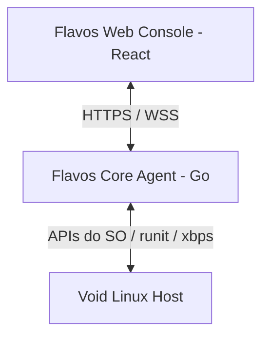

# Flavos OS 2.0

> "Flavos OS 2.0 é um sistema baseado em Void Linux com um núcleo comum chamado Flavos OS Core, projetado para rodar em perfis cloud, desktop e legacy, mantendo uma camada unificada de controle via API e console."

---

## 📌 Visão Geral & Objetivo

O **Flavos OS 2.0** é o renascimento do descontinuado *Flavos OS 0.1 Preview*. Nesta nova encarnação, o projeto é estruturado em torno de um núcleo modular chamado **Flavos OS Core**, que gerencia o sistema base e expõe APIs seguras para controle remoto.

A primeira edição e foco principal atual do projeto é a **Cloud Edition** (Headless), voltada para transformar uma VPS Linux comum em um servidor de infraestrutura privada altamente controlável, oferecendo telemetria, logs de auditoria, API REST de gerenciamento de serviços e comunicação em tempo real. Futuramente, o mesmo núcleo será adaptado em edições gráficas (Desktop e Legacy) para uso pessoal e hardware antigo.

---

## 💻 Edições do Flavos OS 2.0

O Flavos OS 2.0 é organizado em torno de um núcleo comum chamado **Flavos OS Core**.

Esse Core roda em todas as edições e inclui:

- Void Linux Base;
- runit;
- xbps;
- Flavos Core Agent;
- API local;
- autenticação;
- Service Manager;
- integração futura com o Web Console.

As edições previstas são:

| Edição | Uso | Interface | Status |
|---|---|---|---|
| Cloud Edition | VPS, servidores e cloud | Headless | Em desenvolvimento |
| Desktop Edition | Uso pessoal | KDE/GNOME | Protótipo validado (D1) |
| Legacy Edition | PCs antigos | XFCE/LXQt | Planejada |

A Cloud Edition é o foco atual, mas Desktop e Legacy reutilizarão o mesmo Flavos OS Core.

Para detalhes, consulte [docs/EDITIONS.md](docs/EDITIONS.md).

---

## 🛠️ Stack Planejada

- **Sistema Base:** [Void Linux x86_64 (glibc)](https://voidlinux.org/)
- **Sistema de Init:** `runit`
- **Gerenciador de Pacotes:** `xbps`
- **Agent Core:** Go / Golang (sem dependências externas pesadas, focado em performance e segurança)
- **Web Console (Dashboard):** React + Vite + TailwindCSS
- **Banco de Dados local:** SQLite (para logs locais e configurações do Agent)
- **Comunicação:** API REST (HTTP/JSON) e WebSockets (para telemetria de tempo real)

---

## 🏗️ Arquitetura Resumida

A arquitetura do Flavos OS é dividida em três camadas fundamentais:

1. **Camada 1 (Host):** Void Linux com init `runit` e gerenciador `xbps`.
2. **Camada 2 (Agent):** `flavos-agent` escrito em Go que expõe a API local.
3. **Camada 3 (Console):** Painel web em React para gerenciar e visualizar a saúde de múltiplas instâncias.

Para detalhes completos da arquitetura, consulte [docs/ARCHITECTURE.md](docs/ARCHITECTURE.md).

---

## 📅 Roadmap Resumido

- **Fase 0:** Fundação do Projeto (Escopo, Estrutura, Regras de Segurança) 🟢
- **Fase 1:** Criação do Ambiente de Desenvolvimento (Void Linux + QEMU/KVM) 🟢
- **Fase 2:** Desenvolvimento do Flavos Core Agent MVP (Go, Healthcheck, endpoints iniciais) 🟢
- **Fase 3:** Integração do Agent como serviço nativo do `runit` 🟢
- **Fase 4:** Autenticação Inicial (Token de acesso estático na API) 🟢
- **Fase 5:** Desenvolvimento do Service Manager (Start, Stop, Restart via API) 🟢
- **Fase 5.5:** Arquitetura por Edições (Cloud, Desktop, Legacy) 🟢
- **Fase D1:** Protótipo Desktop Edition (KDE Plasma, SDDM, Web Console local) 🟢
- **Fase L1:** Protótipo Legacy Edition (XFCE, LXQt, Openbox leve) 🔴
- **Fase 6:** Coleta de Logs e Auditoria (Audit Log gravado localmente) 🟢
- **Fase 7:** Desenvolvimento do Flavos Web Console MVP (Dashboard React) 🟢
- **Fase 8:** Telemetria em tempo real via WebSocket (CPU, RAM, Rede) 🔴
- **Fase 9:** Hardening e Empacotamento (.xbps ou binários estáticos) 🔴
- **Fase 10:** Lançamento da Preview 0.1 Final 🔴

Para o cronograma detalhado, consulte [docs/ROADMAP.md](docs/ROADMAP.md).

---

## 🔒 Aviso de Segurança Importante

Como o **Flavos OS 2.0** expõe controles do sistema operacional hospedeiro por meio de uma API, a segurança é nossa prioridade máxima.
- **Sem Terminal Livre:** O MVP não permite a execução de comandos shell arbitrários.
- **Whitelist de Serviços:** Apenas serviços pré-configurados podem ser manipulados (iniciados/parados).
- **Sem Instalador de Pacotes Remoto:** Instalações de pacotes via API estão desabilitadas por padrão no MVP para mitigar riscos de Remote Code Execution (RCE).
- **Autenticação:** Toda requisição à API exige um token criptograficamente seguro fornecido no Header.

Consulte [docs/SECURITY.md](docs/SECURITY.md) para entender as diretrizes de segurança aplicadas ao desenvolvimento.

---

## 📝 Licença
Licença comercial/open-source **a definir**.
Todos os direitos reservados à **Flavos Company**.
